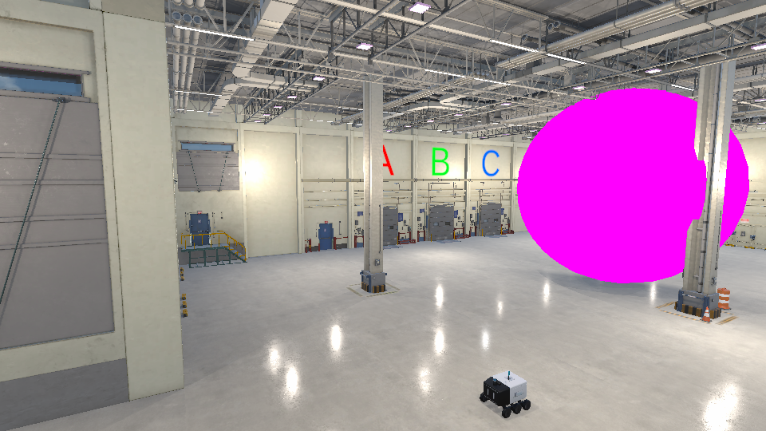
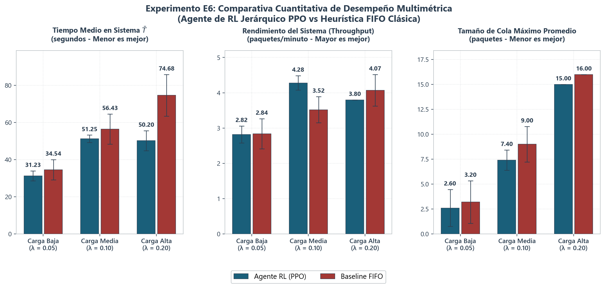
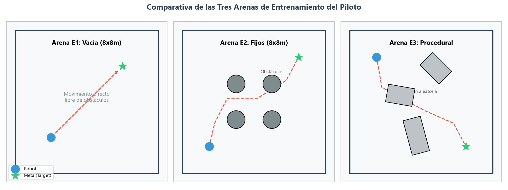
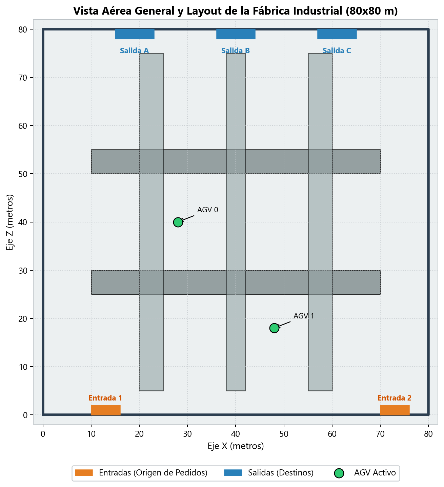
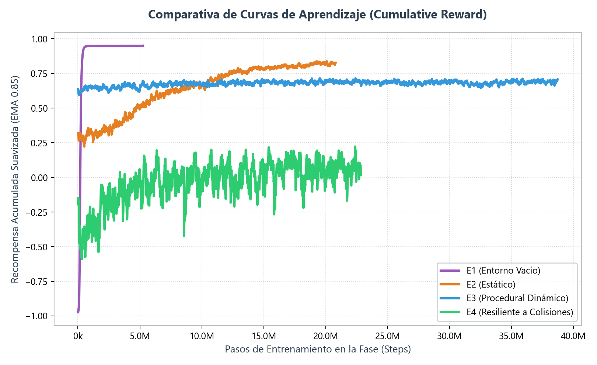
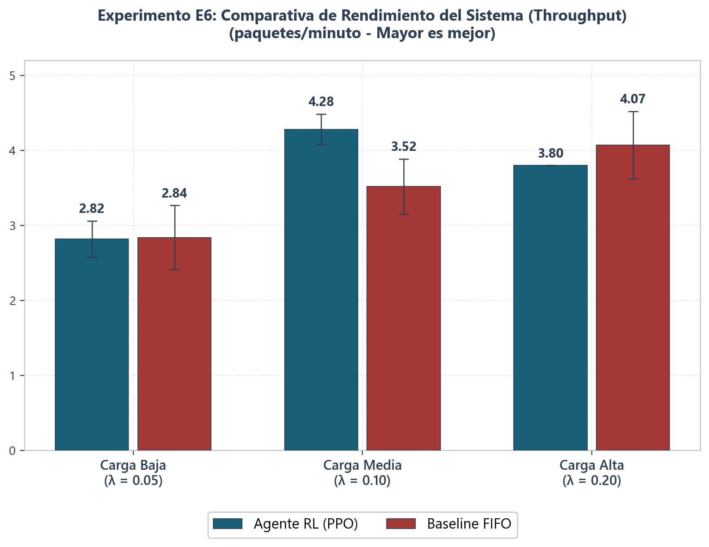
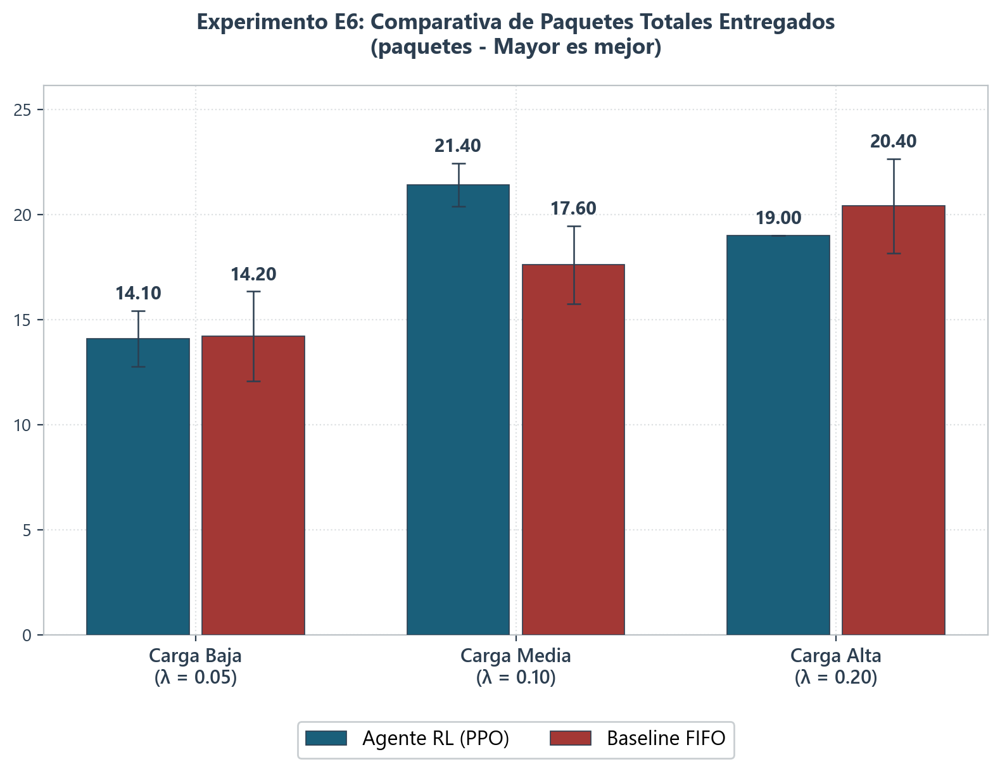
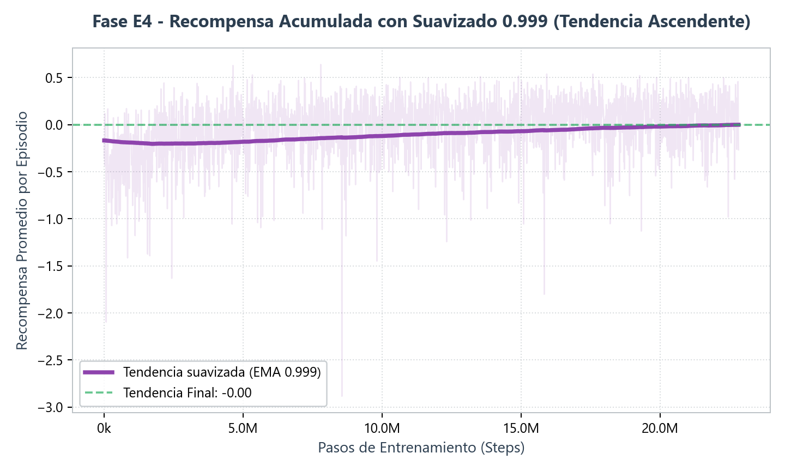

# Autonomous Warehouse Logistics with Deep Reinforcement Learning in Unity

[Versión en español](README.es.md)

Bachelor's Thesis — Industrial Technologies Engineering, **University of Málaga (UMA)**, 2025–2026.

A fleet of AGVs (Automated Guided Vehicles) learns to manage warehouse orders and navigate a simulated 3D factory entirely through **Deep Reinforcement Learning (PPO)**, built with **Unity ML-Agents**. Orders arrive stochastically following a **Poisson distribution**, and robots must navigate among dynamic obstacles while a manager agent assigns tasks across the fleet.

<div align="center">
  
  <p><i>The 3D warehouse environment with the logistics robot (RobotUma).</i></p>
</div>

## Key finding

> **An adaptive RL model outperforms a purely algorithmic solution as soon as an unforeseen variable appears** — a solid foundation for realistic industrial digital twins.

<div align="center">
  
  <p><i>Manager comparison: RL-based dispatching vs. algorithmic baseline under stochastic order arrivals.</i></p>
</div>

## Architecture

Two-tier hierarchical multi-agent design:

- **Manager agent** — learns optimal package↔robot allocation across the fleet, reacting to queue states and order arrivals.
- **Pilot agents (PPO)** — pre-trained physical navigation policy, agnostic to the final environment: continuous observation space with dynamic normalization and dense distance-based reward shaping.

<div align="center">
  
  <p><i>Stochastic order generation (Poisson process) driving the logistics workload.</i></p>
</div>

## Two-stage curriculum learning

The pilot was trained through progressively harder arenas (empty room → fixed obstacles → procedural obstacles → full factory), which sped up convergence and improved robustness to unseen variables:

<div align="center">
  
  <p><i>Training arenas: empty (E1), fixed obstacles (E2), procedural (E3).</i></p>
</div>

<div align="center">
  
  <p><i>Final environment: 80×80 m industrial factory.</i></p>
</div>

## Training results

<div align="center">
  
  <p><i>Cumulative reward across training phases (TensorBoard).</i></p>
</div>

<div align="center">
  <table width="100%">
    <tr>
      <td width="50%" align="center">
        
        <br><i>System performance comparison.</i>
      </td>
      <td width="50%" align="center">
        
        <br><i>Throughput under stochastic arrivals.</i>
      </td>
    </tr>
  </table>
</div>

Iterative reward-shaping experiments (E1→E6) refined turn smoothing and collision penalties:

<div align="center">
  
</div>

## Tech stack

Unity 6 (6000.0.40f1) · ML-Agents Toolkit · PPO · C# · Python 3.8–3.10 · TensorBoard

## Project structure

```
├── Assets/              # C# scripts, 3D scenes, prefabs, trained models (.onnx)
├── Packages/            # Unity package manifest
├── ProjectSettings/     # Unity project configuration
├── config/              # ML-Agents YAML hyperparameters (experiments E1–E6)
├── results/             # Training outputs: network weights and TensorBoard logs
├── docs/                # Figures, screenshots and the full thesis PDF (Spanish)
└── tools_demo/          # Auxiliary Python scripts for demos and direct control
```

> **Note:** third-party Asset Store packages (visual assets, textures, audio) are not included in this repository for licensing and size reasons. The project's own code, scenes, configurations and trained models are all here.

## Getting started

```bash
git clone https://github.com/<your-user>/warehouse-agv-deep-rl.git
```

1. Open the project folder with **Unity Hub** (Unity 6 / 6000.0.40f1 or later).
2. Load the main scene from `Assets/Scenes/`.
3. Train an experiment (e.g. the full factory, E6):

```bash
pip install mlagents
mlagents-learn config/E6_FabricaReal_DesdeCero.yaml --run-id=E6_FabricaReal_Test
# press Play in the Unity Editor when prompted
tensorboard --logdir results
```

## Thesis document

The full written thesis (in Spanish) is available at [`docs/TFG_Memoria_DanielBustos.pdf`](docs/TFG_Memoria_DanielBustos.pdf).

## Author

**Daniel Bustos Cano** — [LinkedIn](https://linkedin.com/in/daniel-bustos-cano) · dabuca2001@gmail.com

Academic supervisors: Manuel Castellano Quero, Juan Antonio Fernández Madrigal — Dept. of Systems Engineering and Automation (ISA), School of Industrial Engineering, University of Málaga.
