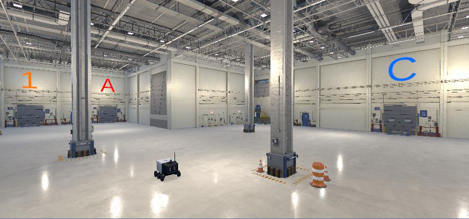
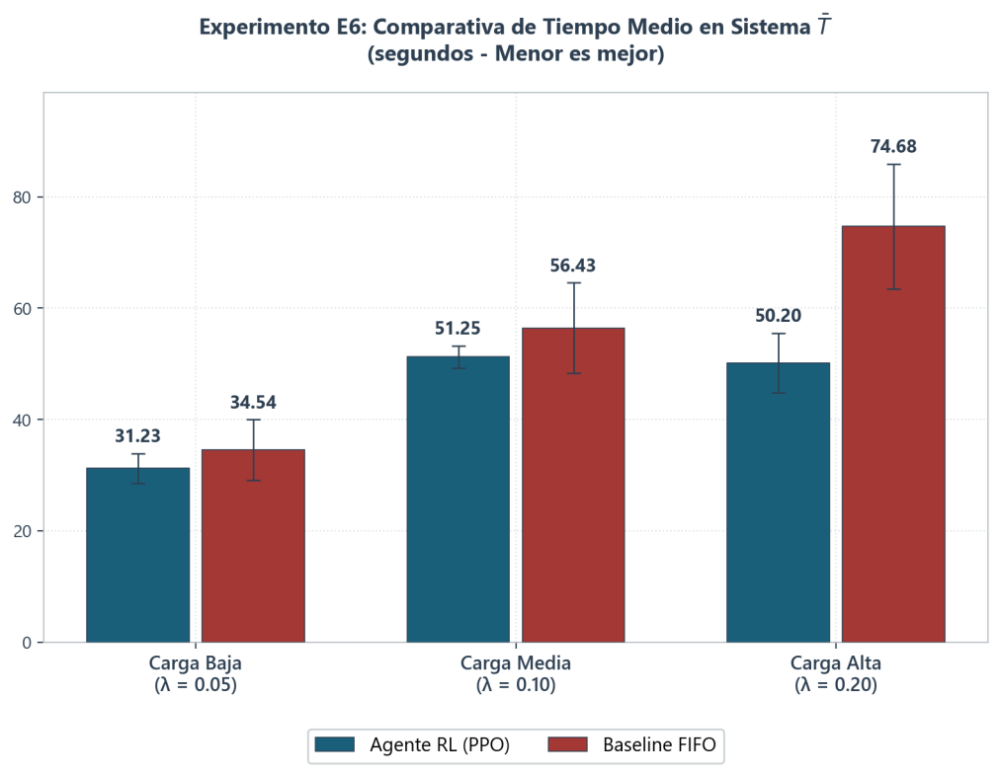
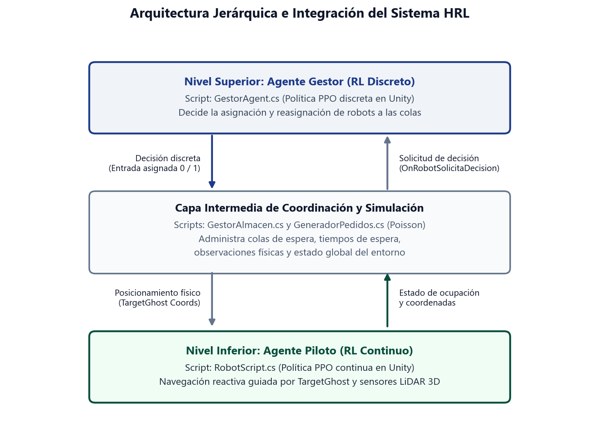
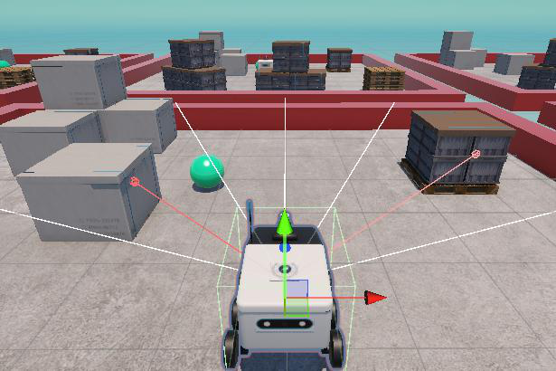
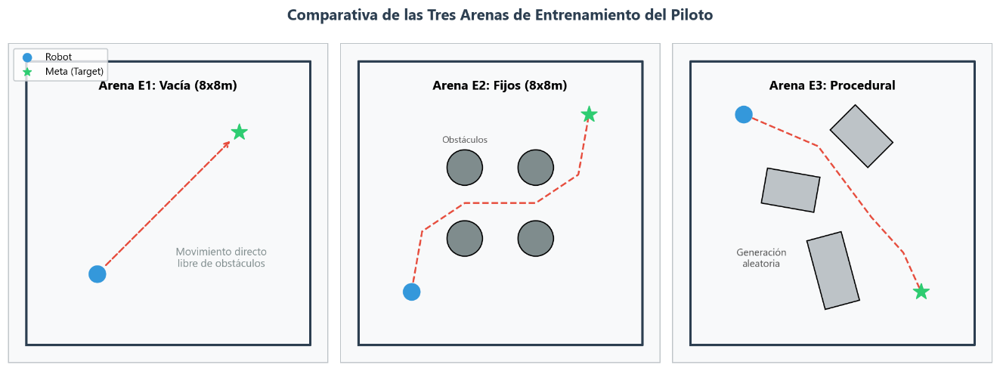
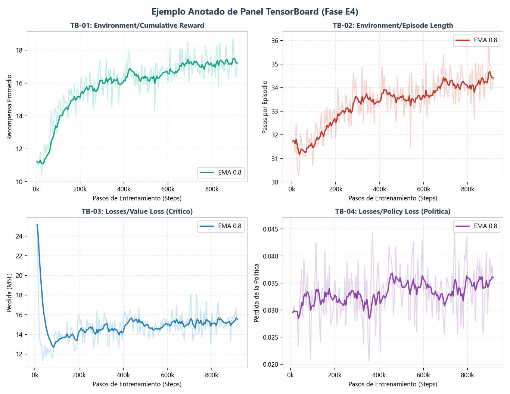
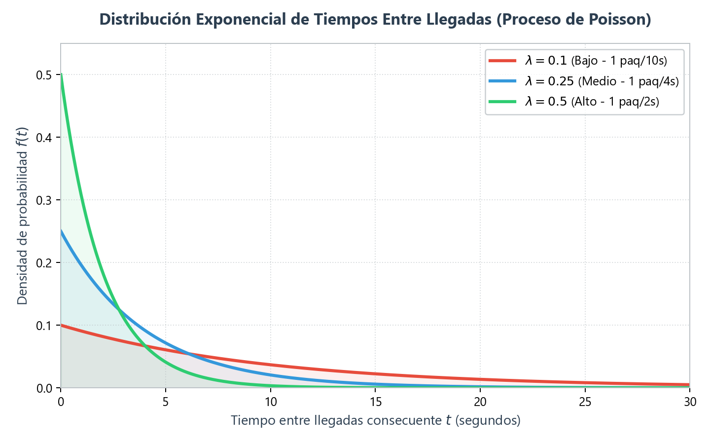

# Autonomous Warehouse Logistics with Hierarchical Deep Reinforcement Learning

[Versión en español](README.es.md)

Bachelor's Thesis — Industrial Technologies Engineering, **University of Málaga (UMA)**, 2025–2026.

A **hierarchical Deep RL system (HRL)** built in **Unity 6 + ML-Agents** where AGVs (Automated Guided Vehicles) learn to run the logistics of a simulated industrial warehouse end-to-end: a high-level **Manager agent (discrete PPO)** assigns and dynamically re-assigns pick-up tasks across the fleet, while a low-level **Pilot agent (continuous PPO)** drives each robot, avoiding obstacles with a simulated 3D LiDAR. Orders arrive stochastically following a **Poisson process**, and the whole system is validated in a realistic **80×80 m factory** against a classic industrial FIFO dispatcher.

<div align="center">
  
  <p><i>The final deployment environment: an 80×80 m industrial factory with entry docks (1, 2) and delivery zones (A, B, C).</i></p>
</div>

## Key results — RL dispatcher vs. FIFO baseline

Evaluation protocol: 30 independent runs (5 per strategy × 3 Poisson arrival rates λ), 300 s of simulated time each, fleet of N = 2 AGVs.

| Metric | Load level | RL Manager (PPO) | FIFO baseline | Improvement |
|---|---|---|---|---|
| Avg. time in system | High (λ = 0.20) | **50.20 s** | 74.68 s | **−32.8%** |
| Throughput (packages delivered) | Medium (λ = 0.10) | **21.40** | 17.60 | **+21.6%** |
| Avg. time in system | Medium (λ = 0.10) | **51.25 s** | 56.43 s | **−9.2%** |
| Avg. max queue length | Medium (λ = 0.10) | **7.40** | 9.00 | **−17.8%** |

Under extreme load the RL Manager is also far more **stable**: its time-in-system standard deviation is less than half of FIFO's (σ ≈ 4.8 s vs ≈ 10.5 s), because it learns to balance flows between entry docks and to avoid queue overflow instead of greedily accepting work.

<div align="center">
  <table width="100%">
    <tr>
      <td width="50%" align="center">
        
        <br><i>Avg. time in system (lower is better).</i>
      </td>
      <td width="50%" align="center">
        
        <br><i>Total packages delivered (higher is better).</i>
      </td>
    </tr>
  </table>
</div>

## Architecture: two RL agents + a discrete-event simulation layer

<div align="center">
  
</div>

- **Manager — high-level decision agent** (`GestorAgent.cs`, discrete PPO): observes a 38-float global state (queue lengths, one-hot fleet status, critical waiting times, destination previews, requesting-robot position/ID) and assigns each free AGV to an entry dock. Uses **action masking** to disable invalid assignments and an implicit **no-op** to keep robots on course.
- **Coordination & simulation layer** (`GestorAlmacen.cs`, `GeneradorPedidos.cs`): a discrete-event simulator written in C# — stochastic order generation via Poisson process (exponential inter-arrival times), logical queues, package life cycle and waiting-time bookkeeping. No learning here: it translates the Manager's abstract decisions into physical target coordinates.
- **Pilot — low-level navigation agent** (`RobotScript.cs`, continuous PPO): fully **egocentric observations** (10-float local vector + `RayPerceptionSensor3D` simulating a LiDAR) so the learned policy never memorizes absolute map positions and generalizes to unseen layouts. Two continuous actions (linear acceleration, angular velocity) with **no reverse gear**, mirroring real industrial AGVs (25 kg, 1.5 m/s, 200°/s).

<div align="center">
  
  <p><i>The Pilot's observation space: egocentric vector + LiDAR-like ray perception.</i></p>
</div>

## Training: six-phase curriculum (E1–E6)

The Pilot was trained through a failure-driven curriculum — each phase fixes a limitation found in the previous one, inheriting the network weights:

| Phase | Goal | Environment | Total steps | Key capability |
|---|---|---|---|---|
| E1 | Basic navigation | Empty arena (8×8 m) | 5.25 M | Direct, fluid goal-reaching |
| E2 | Static obstacle avoidance | 4 fixed columns | 15.0 M | Avoids obstacles in line of sight |
| E3 | Generalization | Procedural random arenas | 38.7 M (cum.) | **99% success on unseen maps** |
| E4 | Collision resilience | Procedural + non-lethal collisions | 61.5 M (cum.) | Autonomous unjamming maneuvers |
| E5 | Smooth guidance | Factory corridors (80×80 m) | 80.0 M (cum.) | Stable trajectories, no zigzag |
| E6 | Fleet coordination (Manager) | Full factory, N = 2 AGVs | 2.0 M (Manager) | −32.8% time in system under high load |

<div align="center">
  
  <p><i>The three Pilot training arenas: E1 (empty), E2 (fixed obstacles), E3 (procedural).</i></p>
</div>

<div align="center">
  
  <p><i>The four PPO training metrics monitored in TensorBoard (cumulative reward, episode length, value loss, policy loss).</i></p>
</div>

### Engineering highlights

- **Generalization gap solved without retraining**: transferring the Pilot from 8×8 m arenas to the 80×80 m factory (10× scale) initially broke the policy (out-of-distribution shift). Dynamic normalization of the distance vector plus delta-distance reward shaping transferred all learned skills with **zero additional training**.
- **Reward design evolution**: sparse reward with instant episode death (E1–E3) → non-lethal collisions with sustained-contact penalty to teach unjamming (E4) → dense delta-distance shaping with angular penalties for smooth driving (E5).
- **Stochastic demand modeling**: order arrivals follow a parameterizable Poisson process; the three evaluation regimes (λ = 0.05 / 0.10 / 0.20) correspond to one package every 20 / 10 / 5 seconds.

<div align="center">
  
  <p><i>Exponential inter-arrival time distribution driving the stochastic order generation.</i></p>
</div>

## Tech stack

Unity 6 (6000.0.40f1) · ML-Agents Toolkit (PyTorch backend, gRPC) · PPO · C# · Python 3.10 · TensorBoard

## Project structure

```
├── Assets/              # C# scripts, 3D scenes, prefabs, trained models (.onnx)
├── Packages/            # Unity package manifest
├── ProjectSettings/     # Unity project configuration
├── config/              # ML-Agents YAML hyperparameters (experiments E1–E6)
├── results/             # Training outputs: network weights and TensorBoard logs
├── docs/                # Figures from the thesis and the full thesis PDF (Spanish)
└── tools_demo/          # Auxiliary Python scripts for demos and direct control
```

> **Note:** third-party Asset Store packages (visual assets, textures, audio) are not included in this repository for licensing and size reasons. The project's own code, scenes, configurations and trained models are all here.

## Getting started

```bash
git clone https://github.com/daniel27bc/Warehouse-AGV-Deep-RL.git
```

1. Open the project folder with **Unity Hub** (Unity 6 / 6000.0.40f1 or later).
2. Load the main scene from `Assets/Scenes/`.
3. Train an experiment (e.g. the full factory, E6):

```bash
pip install mlagents
mlagents-learn config/E6_FabricaReal_DesdeCero.yaml --run-id=E6_FabricaReal_Test
# press Play in the Unity Editor when prompted
tensorboard --logdir results
```

## Thesis document

The full written thesis (in Spanish, 75 pages) is available at [`docs/TFG_Memoria_DanielBustos.pdf`](docs/TFG_Memoria_DanielBustos.pdf). The source code is MIT-licensed; the thesis document itself is © Daniel Bustos Cano, all rights reserved.

## Author

**Daniel Bustos Cano** — [LinkedIn](https://linkedin.com/in/daniel-bustos-cano) · dabuca2001@gmail.com

Academic supervisors: Manuel Castellano Quero, Juan Antonio Fernández Madrigal — Dept. of Systems Engineering and Automation (ISA), School of Industrial Engineering, University of Málaga.
